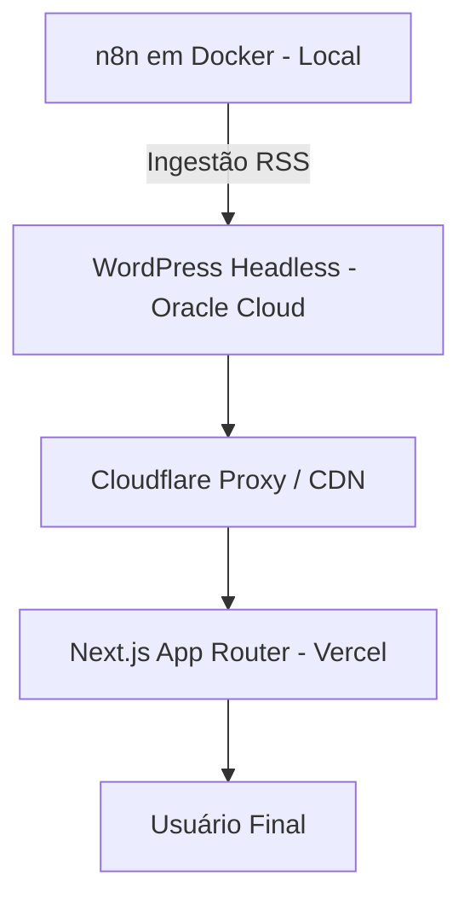

# 🎮 Revista Gamer — Portal de Notícias & E-sports

> **Acesse o projeto online:** https://revistagamer.com.br

A **Revista Gamer** é uma plataforma moderna de notícias de jogos e e-sports focada em alta performance, otimização extrema para SEO, acessibilidade (a11y) e entrega de conteúdo dinâmico. 

O projeto adota uma **arquitetura desacoplada (Headless CMS)** para garantir segurança na infraestrutura, consumo eficiente de dados via API e carregamento ultra-rápido no front-end.

---

## 🛠️️ Tech Stack & Arquitetura

### Front-end & Interface
* **Framework:** Next.js (App Router) + React
* **Linguagem:** TypeScript
* **Estilização:** Tailwind CSS
* **Acessibilidade & Semântica:** HTML5 Semântico, marcações ARIA e conformidade com diretrizes WAI-ARIA (a11y)
* **Hospedagem & Deploy:** Vercel

### Back-end & Infraestrutura Cloud
* **Headless CMS:** WordPress (utilizado estritamente como headless via REST API)
* **Servidor Cloud:** Oracle Cloud Infrastructure (OCI - Instância de 1GB RAM dedicada para a API do WordPress)
* **CDN, Segurança & Edge:** Cloudflare (gerenciamento de DNS, proteção DDoS e cache na borda para a API e aplicação)
* **Automação de Workflows:** n8n em **Docker** (executado em ambiente local/on-demand devido ao footprint de memória da nuvem)

---

## ⚡ Diferenciais Técnicos & Decisões de Arquitetura

### 1. Arquitetura Desacoplada (Headless)
Ao separar o painel de administração da camada de exibição visual, a aplicação elimina o gargalo tradicional do render do WordPress, entregando páginas renderizadas no servidor (**Server-Side Rendering / ISR**) através do Next.js na Vercel.

### 2. Gestão Pragmática de Recursos Cloud & Automação (n8n + Docker)
* **Engenharia de Infraestrutura:** Visando máxima estabilidade do WordPress Headless na instância OCI de 1GB RAM, optou-se por isolar o **n8n** em container **Docker local**, rodando sob demanda para tarefas de automação.
* **Pipeline de Automação:** O n8n faz a ingestão automatizada de feeds RSS e o pré-processamento de pautas/rascunhos, enviando os dados limpos via API para o WordPress na nuvem. A arquitetura está pronta para migração do container para instâncias Ampere ARM de maior capacidade assim que disponíveis.

### 3. SEO de Alta Performance & Open Graph
* **Geração Dinâmica de Metadados:** Utilização da API `generateMetadata` do Next.js para injetar metadados dinâmicos baseados no conteúdo do WordPress.
* **Social Cards (Open Graph):** Mapeamento completo de tags `og:title`, `og:description` e `og:image` para compartilhamento otimizado no WhatsApp, Discord e redes sociais.
* **Tratamento de Dados no Servidor:** Sanitização e decodificação de entidades HTML no servidor para evitar falhas de indexação nos motores de busca.
* **Formatos Modernos:** Uso padronizado de imagens no formato WebP com redimensionamento e lazy loading nativo.

---

## 📐 Visão Geral da Arquitetura

---

## 📸 Demonstração do Projeto

https://github.com/user-attachments/assets/5d5533fc-c831-4b9b-84e1-819a869f4b84

---

## 👤 Autor

**Rogério Leal** — *Full Stack Developer*

* **Portfolio:** revistagamer.com.br
* **E-mail:** rogerionarcizoleal@gmail.com
* **LinkedIn:** linkedin.com/in/rogério-leal

